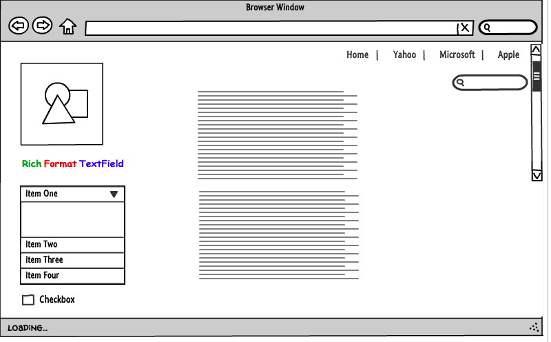
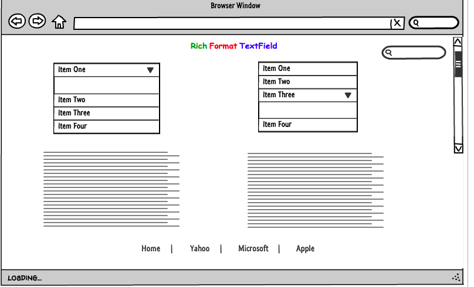

What is a wireframe?
*Visual presentation, structure,of a website by simple line drawing, it is kinda like a skeleton or, like a sketch of how you would like your website to look like. Its key elements are: header(the first thing you want users to see), body(followed by a content), footer(not so important stuff)*
What are the benefits of wireframing?
*It surely gives a clear path of what has to be done,like which techniques needs to be used to have an excellent results, pretty similar like building a house, when you have the sketch of your desired floor plan you know what to do to make it happen, saves time for sure.*
Did you enjoy wireframing your site?
*I absolutely did , even though i kinda stick with one page and very basic ones*
Did you revise your wireframe or stick with your first idea?
*i did revise them , and now that i think maybe the previous one was better, but the good thing is that i can still change it or add things to it :)))*
What questions did you ask during this challenge? What resources did you find to help you answer them?
*I think i am still confused with this index page, home page , template files ..*
