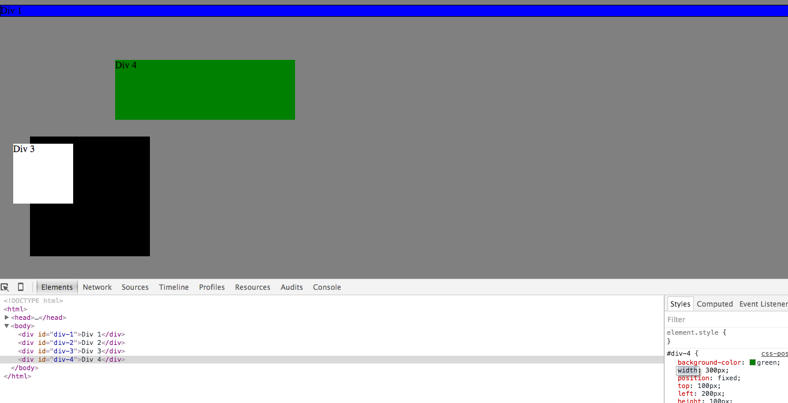
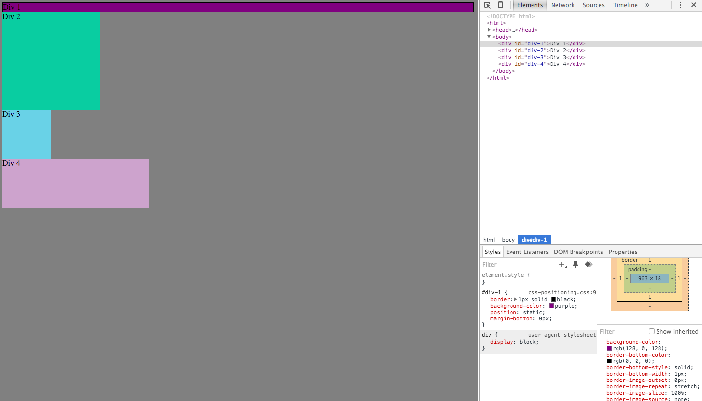
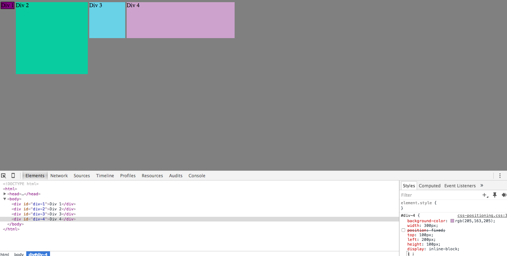
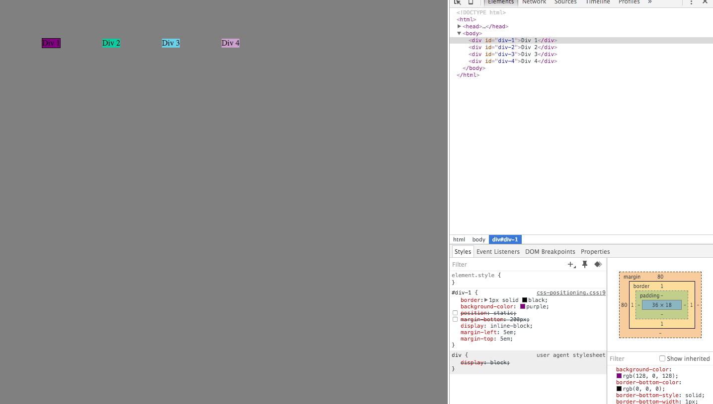
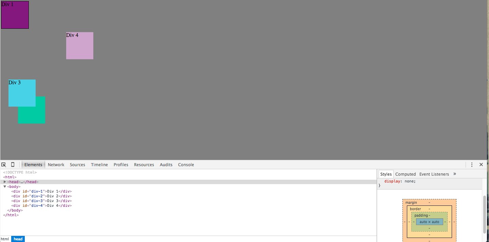
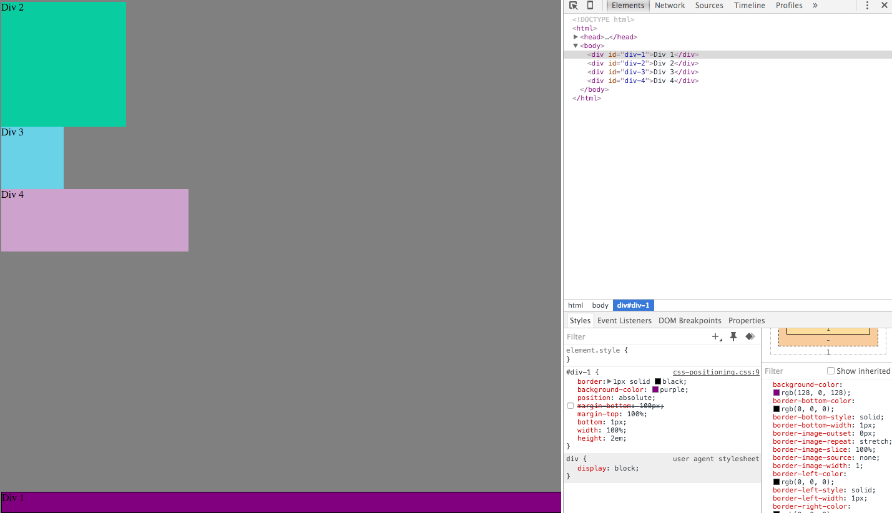
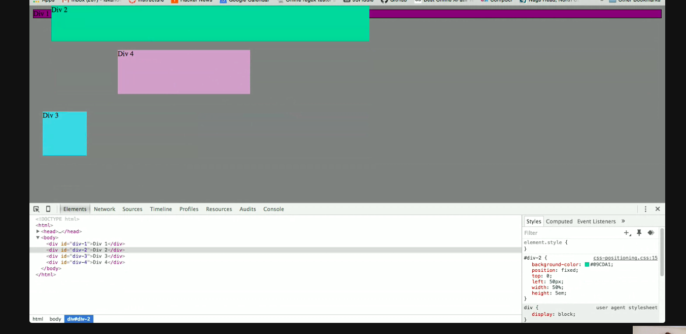
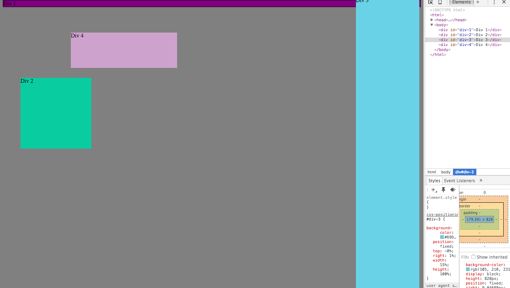
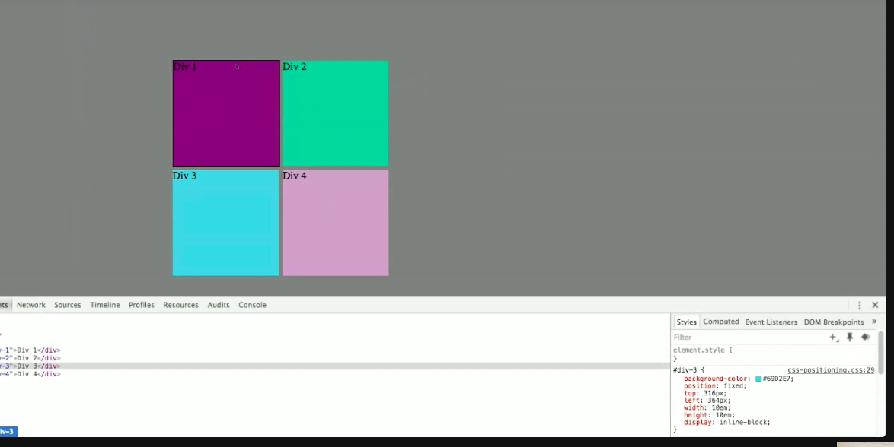

<!--
How can you use Chrome's DevTools inspector to help you format or position elements?
We can open the DevTools inspector on a Mac from the main application manu bar select View than Developer than Developer Tools once there we select the Element tab that is the structure of the we page, there we can add or change the  positions of any elements of that page.It is fast way of showing us how the page will look like , once we love how it was styled we save the changes.
How can you resize elements on the DOM using CSS?
I think add a height and width properties or if they had it already change the number of it instead height:5em; make them height:8em; same for the width ,
What are the differences between absolute, fixed, static, and relative positioning? Which did you find easiest to use? Which was most difficult?
Absolute -positions to the top-left of its nearest parent,
Fixed -positions kinda sticks to the browser window , it doesn't scroll together with the document .
Static- positions the way the element will appear in its normal flow , it will pretty much not make any diference if you add a static position or not ...please corect me if i am wrong that is how i got it.
Relative-positions relative to the page margins of the document,(i also need and additional explanation on tis one).
The easiest to use was the fixed and the most difficult is the relative i definitely  need to do some more research on this.
What are the differences between margin, border, and padding?
Padding is the space thats inside the element between the content and the border and goes around all four sides of the content, Border is the space between the padding and the margin same as padding goes around all four sides of the content, Margin is the space between the border and the next content, that space outside the border  is called margin.
What was your impression of this challenge overall? (love, hate, and why?)
It is not easy for sure , but i would love to have more time to play with it, so much more to learn , and i love it because you can do so many things, it is just amazing.

-->