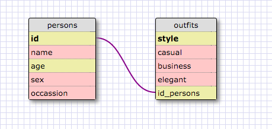

Release 5:

1. 
SELECT * FROM states; 

2. 
SELECT * FROM regions; 

3. 
SELECT state_name, population 
FROM states; 

4. 
SELECT state_name, population 
FROM states 
ORDER BY population DESC; 

5. 
SELECT state_name 
FROM states 
WHERE region_id = 7; 

6. 
SELECT state_name, population_density 
FROM states 
WHERE population_density > 50 
ORDER BY population_density ASC; 

7. 
SELECT state_name 
FROM states 
WHERE population BETWEEN 1000000 and 1500000; 

8. 
SELECT state_name, region_id 
FROM states 
ORDER BY region_id ASC; 

9. 
SELECT region_name 
FROM regions 
WHERE region_name LIKE '%Central'; 

10. 
SELECT state_name, region_name 
FROM regions 
JOIN states 
ON states.region_id = regions.id 
ORDER BY region_id ASC; 

 Release 6:

**REFLECT :** 
**1. What are databases for?** 
*We use databases for storing date for easy access.* 
**2. What is a one-to-many relationship?** 
*Relashionship that two different objects share, where the first object belongs to the second object, and the second object has many types of the first object* 
**3. What is a primary key? What is a foreign key? How can you determine which is which?** 
_A table typically has a column or combination of columns that contain values that uniquely identify each row in the table. This column, or columns, is called the **primary key (PK)** of the table and enforces the entity integrity of the table. Because primary key constraints guarantee unique data, they are frequently defined on an identity column.When you specify a primary key constraint for a table, the Database Engine enforces data uniqueness by automatically creating a unique index for the primary key columns. This index also permits fast access to data when the primary key is used in queries. If a primary key constraint is defined on more than one column, values may be duplicated within one column, but each combination of values from all the columns in the primary key constraint definition must be unique._ 
_A **foreign key (FK)** is a column or combination of columns that is used to establish and enforce a link between the data in two tables to control the data that can be stored in the foreign key table. In a foreign key reference, a link is created between two tables when the column or columns that hold the primary key value for one table are referenced by the column or columns in another table. This column becomes a foreign key in the second table._ 
 
https://msdn.microsoft.com/en-us/library/ms179610.aspx 

**4. How can you select information out of a SQL database? What are some general guidelines for that?** 
*We can use SELECT command to send a query to the table.The general guideline looks something like this: SELECT column_name FROM table_name;*
