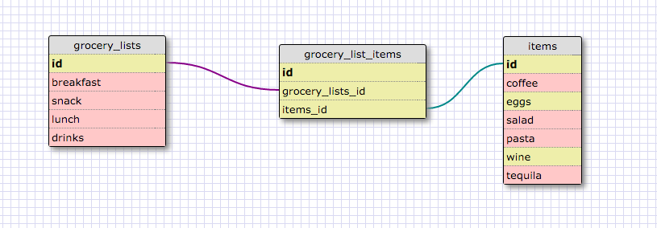

This schema is a one of one relationship because a student can have only one student id number, and that number can be assigned to one student only. 
 
 
 
 
 

Reflect: 
**What is a one-to-one database?** 
_One-to-one relationships are used when two things have a single relationship to one another_ 
**When would you use a one-to-one database? (Think generally, not in terms of the example you created).** 
_When you want to establish a table pairing of unique objects , and if you have a relationship where a group of fields can all optionally be empty (signified by NULL)..pretty much it doesn't always need a pair value ..._ 
**What is a many-to-many database?** 
_So we have 3 tables/databases ,the **First one** contains types of the **Second one** and the **Second one** contains many types of the **First one**, and if we create **Third table** known as  **Junction table** where each row represents an item of a particular table and can be viewed in that joining table(juvenile table ) and keep track of which item you bought from the list etc._ 
**When would you use a many-to-many database? (Think generally, not in terms of the example you created).** 
_When you want to see the all the relationships between the two tables..._ 
**What is confusing about database schemas? What makes sense?** 
_Schemas are very confusing for me , The one to one made sense the most ..:),!_

